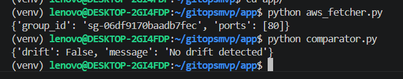
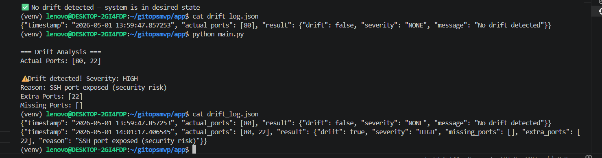
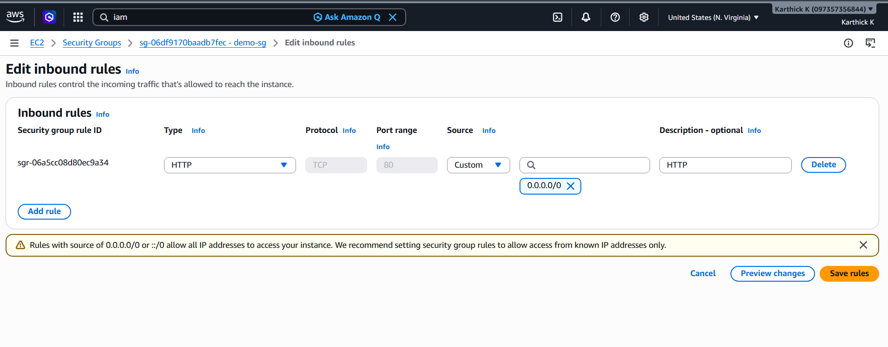

# GitOps Drift Detection ENGINE

##  Introduction

This project is a lightweight GitOps-based drift detection system built to identify configuration mismatches between the desired infrastructure state (defined in Terraform) and the actual state in AWS.

It continuously monitors AWS resources and detects unauthorized or manual changes, helping maintain infrastructure consistency and security.

---

##  Why this project

In real-world cloud environments:

* Engineers sometimes make manual changes in AWS Console
* Infrastructure drifts away from IaC (Terraform)
* This leads to:

  * Security risks (e.g., SSH exposed)
  * Compliance issues
  * Unpredictable system behavior

This project solves that by:

> Automatically detecting and classifying infrastructure drift

---

##  Tech Stack

* **AWS EC2** – Security Group resource
* **Terraform** – Desired infrastructure state
* **Python (boto3)** – Fetch actual AWS state
* **Git** – Version control
* **WSL (Ubuntu)** – Development environment

---


##  Architecture Diagram


                 ┌──────────────────────────────┐
                 │        Terraform (IaC)       │
                 │   Defines desired state      │
                 │   (Security Group: Port 80)  │
                 └──────────────┬───────────────┘
                                │
                                │ Desired State
                                ▼
                 ┌──────────────────────────────┐
                 │        AWS Infrastructure    │
                 │      EC2 Security Group      │
                 │   (Actual running config)    │
                 └──────────────┬───────────────┘
                                │
                                │ Fetch via boto3
                                ▼
                 ┌──────────────────────────────┐
                 │     aws_fetcher.py           │
                 │  Extracts actual ports       │
                 └──────────────┬───────────────┘
                                │
                                ▼
                 ┌──────────────────────────────┐
                 │     comparator.py            │
                 │  Compares desired vs actual  │
                 │  Detects drift               │
                 └──────────────┬───────────────┘
                                │
                                ▼
                 ┌──────────────────────────────┐
                 │        main.py               │
                 │  - Orchestrates flow         │
                 │  - Classifies severity       │
                 │  - Logs results              │
                 └──────────────┬───────────────┘
                                │
                                ▼
                 ┌──────────────────────────────┐
                 │      drift_log.json          │
                 │   Stores history & audit     │
                 └──────────────────────────────┘


---

##  Implementation

### 1. Infrastructure Setup (Terraform)

* Created AWS Security Group (`demo-sg`)
* Allowed only port **80 (HTTP)**

---

### 2. Fetch Actual State

* Used `boto3` to:

  * Query AWS EC2
  * Extract open ports from Security Group

---

### 3. Drift Detection Logic

* Compared:

  * Desired ports (Terraform)
  * Actual ports (AWS)

* Identified:

  * Missing ports
  * Extra ports

---

### 4. Severity Classification

* Example:

  * Port 22 (SSH) → **HIGH severity**
  * Other mismatches → **MEDIUM**

---

### 5. Logging

* Every execution logs:

  * Timestamp
  * Actual ports
  * Drift result

Stored in:

```text
app/drift_log.json
```
## No Drift State

System is in expected configuration with no mismatch.


---

##  Drift Detected

Manual change detected in AWS (SSH port opened).



## Security Group


##  Errors Faced & Fixes

### 1. AWS CLI not found (WSL issue)

* Cause: Installed only in Windows
* Fix: Installed inside WSL

---

### 2. Terraform not installing via apt

* Cause: Not in default repo
* Fix: Added HashiCorp repository

---

### 3. Python `externally-managed-environment`

* Cause: PEP 668 restriction
* Fix: Used virtual environment (`venv`)

---

### 4. Import errors in Python

* Cause: Missing or incorrect function definitions
* Fix: Recreated modular structure

---

### 5. Git push error (`refspec main`)

* Cause: No initial commit
* Fix: Added commit before push

---

##  What I Achieved

* Built a working **GitOps drift detection system**
* Detected real-time AWS changes
* Classified drift severity (HIGH/MEDIUM)
* Logged historical drift data
* Structured project using modular design

---

##  Next Phase

* Convert script to **AWS Lambda**
* Trigger via **EventBridge (scheduled runs)**
* Send alerts via **SNS / Slack**
* Replace hardcoded config with dynamic Terraform parsing
* Extend to multiple AWS resources

---

##  Conclusion

This project demonstrates a practical implementation of GitOps principles by ensuring that the infrastructure remains consistent with its declared configuration.

It highlights how even simple automation can significantly improve:

* Security
* Reliability
* Operational visibility

---
